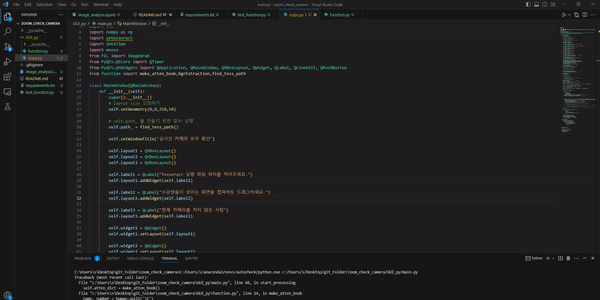

# zoom_check_camera
Zoom에서 수업을 진행시 카메라를 켰는지 확인하는 코드

### 개발환경
- Window 10
- python 3.9.17 (anaconda3)

### 사용방법

OCR model인 Tesseract를 이용하여 Zoom에서 화면을 킨 사람을 확인합니다. 
Tesseract의 한글인식률이 낮아, 번호(사번,학번)로 인식을 하여 카메라를 켰는지 확인합니다.

※ Zoom 화면 보기 기능에서 <b>카메라를 키지 않는 사람은 안보이게 하는 기능</b>이 있는데 이를 활용함.

### 문제점
- 카메라를 킨 사람들과 배경의 색이 다른 점을 이용해서 사람의 수 만큼 Box를 치고,  
  Box안에서 이름표 부분만 Crop하여 인식률을 높였다. 
  여기서 연산과정이 많이 시행되는 듯 하다.
- 약 40명의 사람을 인식하고, 해당 내용을 GPI에 보여주는 데 4 $\pm$ 2초가 소요된다.
- 정확도도 매번 다르게 나온다.

### 개선사항
- 1. 작은 parameter를 가지는 DL model을 만들어 Overfitting 하여 정확도를 올린다. 
     (사용할 때 마다 labeling이 필요할 듯 하다.)
- 2. Zoom의 이름표 부분의 pixel값이 약 ( x:130,  y:20 ) 정도 되니 이정도 크기를 가지면서, 
     Zoom 이름표에서 사용되는 한국어 폰트로 이미지를 만들고 학습한다.
